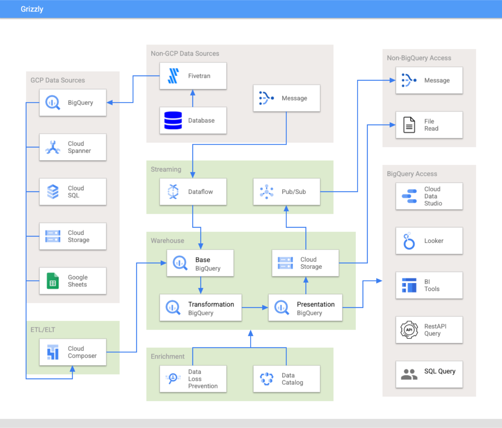

# Grizzly Documentation

## Getting Started
- [Concepts](./concepts.md) - Essential first reading. Understand the high-level concepts of Grizzly's Data Layer and Environment structure before installation.

- [Installation](./install.md) - Steps on how to install the infrastructure for your own Grizzly deployment.

- [Configuration](./configuration.md) - Instructions on how to build out the data layers for your Grizzly deployment. 

## Architecture

